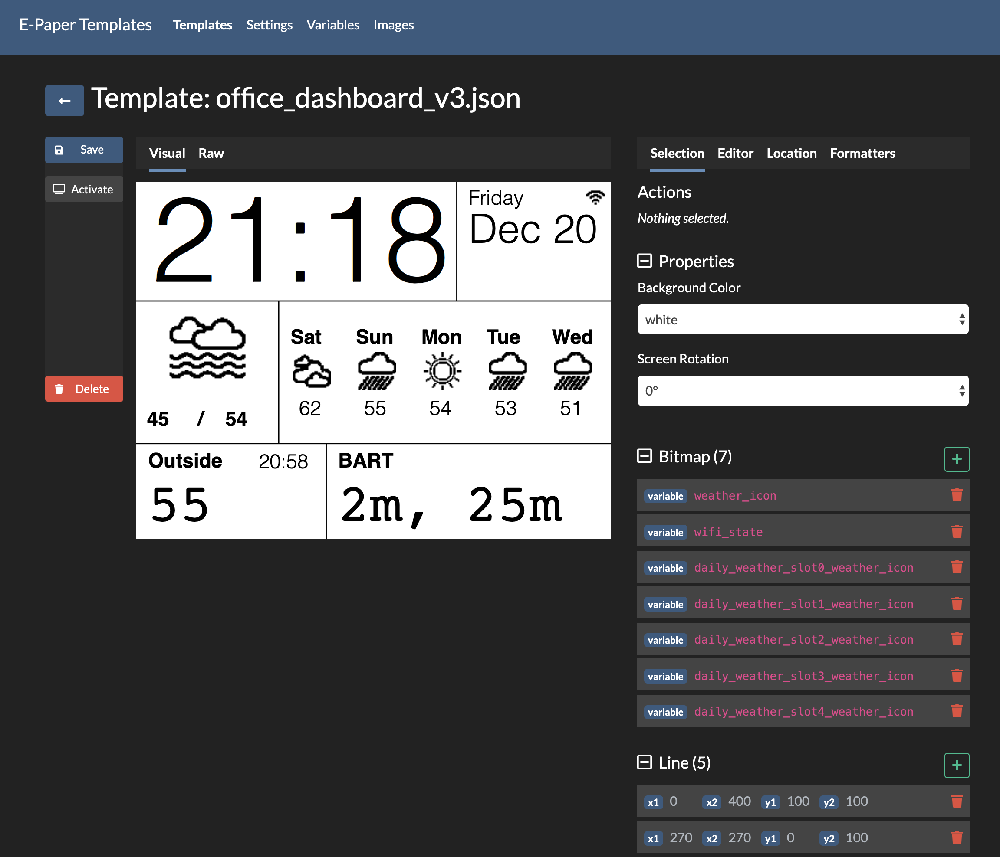

# e-Paper Templates [](https://travis-ci.org/sidoh/epaper_templates) [](https://github.com/sidoh/epaper_templates/releases/latest) [![License][shield-license]][info-license]

Template-oriented driver for e-paper displays using Arduino.  Define a layout with a JSON template, and update the display by changing variables via a REST API or MQTT.

<!-- @import "[TOC]" {cmd="toc" depthFrom=1 depthTo=2 orderedList=false} -->

<!-- code_chunk_output -->

- [Demo](#demo)
- [Examples](#examples)
- [Setup](#setup)
  - [Requirements](#requirements)
  - [Quickstart](#quickstart)
  - [Deep Sleep](#deep-sleep)
  - [SPI Bus and Pin Selection](#spi-bus-and-pin-selection)
- [Concepts](#concepts)
  - [Variables](#variables)
  - [Regions](#regions)
  - [Templates](#templates)
  - [Formatters](#formatters)
  - [Bitmaps](#bitmaps)
- [Integrations](#integrations)
  - [REST API](#rest-api)
  - [MQTT](#mqtt)
- [Web UI](#web-ui)
  - [Template Editor](#template-editor)
      - [Canvas preview](#canvas-preview)
      - [Adding regions](#adding-regions)
      - [Selecting and moving existing regions](#selecting-and-moving-existing-regions)
      - [Keyboard Shortcuts](#keyboard-shortcuts)
      - [Sidebar](#sidebar)
      - [Region fields editor](#region-fields-editor)
      - [Formatters](#formatters-1)
      - [Raw mode](#raw-mode)
  - [Variables](#variables-1)
  - [Images](#images)
      - [Index](#index)
      - [Editor](#editor)
      - [Importing images](#importing-images)
      - [Resize](#resize)
      - [Downloading](#downloading)
      - [Colors](#colors)
- [REST API](#rest-api-1)
- [Development](#development)
  - [Compiling from source](#compiling-from-source)
  - [Local webserver](#local-webserver)

<!-- /code_chunk_output -->

# Demo

[](https://youtu.be/Vg_ctuM1Ppc)
[](https://www.youtube.com/watch?v=h0xRwF95yeg)

# Examples

The [examples directory](./examples) has a few sample templates.  Here are a few:

### Alarm clock

<a href="./examples/alarm_clock"></a>

### Weather Dashboard

<a href="./examples/weather_dashboard"></a>

# Setup

## Requirements

1. An ESP32.
2. A WaveShare e-Paper module.  Any module [supported by GxEPD2](https://github.com/ZinggJM/GxEPD2#supported-spi-e-paper-panels-from-good-display) will work.

## Quickstart

1. Connect display to MCU.  (see [waveshare site](https://www.waveshare.com/wiki/1.54inch_e-Paper_Module) and **SPI Bus and Pin Selection** below for more information)
1. Flash your MCU.
   1. Use a pre-compiled binary from the [releases page](https://github.com/sidoh/epaper_templates/releases).  **Make sure to select the file starting with `INITIALIZER_`**.  You can use [esptool](https://github.com/espressif/esptool) or the [ESP32 flash tool](https://www.espressif.com/en/support/download/other-tools).  Example command:
      ```
      esptool.py --chip esp32 --baud 460800 write_flash 0x1000 INITIALIZER_epaper_templates_esp32-v2.3.0.bin
      ```
   2. With PlatformIO: for example `pio run -e esp32 -t upload`.  You will need to have [nodejs](https://nodejs.org/en/) installed in order to buidl the web assets.
2. Setup WiFi.  A setup AP will appear named `epaper_XXXXXX`.  The default password is **waveshare**.
3. Visit the Web UI to configure further.

## Deep Sleep

e-paper templates can function in _deep sleep_ mode.  When configured, the system will continuously:

1. Wake from sleep
2. Check if a configurable GPIO pin is set.  If it is, stays awake until next reboot
3. Otherwise, stay awake for a configurable period to receive updates and refresh the screen.
4. Put both the ESP32 and the e-paper display into deep sleep mode.

This is useful if trying to conserve power.  Deep sleep mode can be configured in the "Power" tab within the web UI.

## SPI Bus and Pin Selection

The ESP32 has 4 SPI busses, however, one is reserved for the chips Flash. (SPI0) and another is often used by PSRAM (SP1).

In the **Hardware** tab of the settings page, you can select one of the two free SPI busses on the ESP32. (HSPI and VSPI)

|           | VSPI | HSPI (default) |
|-----------|------|----------------|
| DI (MOSI) | 19   | 12             |
| CLK       | 18   | 14             |
| CS (SS)   | 5    | 15             |

Additionally, the displays will require extra pins to be configured to work properly. These are also selectable in the **Hardware** tab.

Please ensure that you do not select pins that conflict with the your SPI Bus/Deep Sleep configurations.

# Concepts

This project aims to strike a particular balance of flexibility and ease-of-use.  In order to understand how to make use of it, let's briefly discuss some primitives:

## Variables

Variables are named values that power dynamic portions of your display (for example, you might have an `outside_temperature` variable).  They can be updated via the REST API or MQTT.

#### Special Variables

* The `timestamp` variable contains the current unix timestamp.  You can use the `time` formatter (more on formatters below) to coerce it into the format you want.  Time is synchronized using NTP.

## Regions

A region defines a displayable unit.  It can be text, an image, or various types of shapes.

## Templates

Templates define the layout of your display, and consists of an arbitrary number of regions.  Templates are made dynamic by binding variables to regions.  You can, for example, define a text region that updates with a variable.

Templates are just JSON files ([schema is available here](./template.schema.json)).  While you can generate these by hand, it's much easier to use the bundled web editor.

## Formatters

Formatters allow you to process the value of a variable within a region.  For example, if the variable `outside_temperature` corresponds to a thermometer reading, its value might contain more precision than you care about (e.g., `72.013045`).  Here, you could use the `round` formatter to trim off excess digits.

You can either define a formatter inline with a variable, or you can create a reusable formatter and attach a reference to it from a variable (this is useful when you have many regions that need to use the same formatter).

## Bitmaps

Bitmaps are displayable images in a very raw format.  Each pixel is represented as a bit in the file; rows ordered left-to-right, columns top-to-bottom.  A `1` means the bit should be on (i.e., the pixel is black).

The bundled web UI comes with a tool to convert any browser-displayable image to this format, as well as a pixel editor to create your own or tweak ones you've already uploaded.

# Integrations

With the single exception of the timestamp, this variable updates are entirely push-based.  In order to make a dynamic display, you'll need to push variable updates using one of the following mechanisms:

## REST API

The RESTful `/api/v1/variables` route allows you to update the variables document like so:

```
$ curl -v -X PUT -H'Content-Type: application/json' -d '{"variable_name":"variable_value"}' http://epaper-display/api/v1/variables
```

Any regions bound to updated variables are immediately updated.

## MQTT

MQTT works similarly, but requires a bit more setup.  The easiest way to get started is by using the UI:


You can alternatively use the `/api/v1/settings` REST route:


```
$ curl -v -X PUT -H'Content-Type: application/json' -d '{
  "mqtt_server": "my-mqtt-broker",
  "mqtt_username": "user",
  "mqtt_password": "hunter2",
  "mqtt_variables_topic_pattern": "template-displays/my_display/:variable_name"
}' http://epaper-display/api/v1/settings
```

**Note here that the `:variable_name` is important!**

After this is done, you can then publish messages to, for example `template-displays/display1/my_cool_variable` to update the value of the variable `my_cool_variable`:

```
mosquitto_pub -h my-mqtt-broker -u user -P hunter2 -t 'template-displays/display1/my_cool_variable' -m "variable_value"
```

# Web UI

This project features a powerful, fully embedded Web UI.  You can configure stuff, visually edit or tweak templates, upload or edit bitmaps, or change variables.

While things are generally pretty viewable on mobile, the heftier pages like the template and bitmap editors don't work well.  This is mostly due to my ineptitude in handling mobile browser events.  Happy to collaborate on a PR for anyone wanting to fix this!

The sections below go into a bit more detail on each of the pages.

## Template Editor

The UI includes a full-featured template editor:



There's a lot going on here, but hopefully most of the useful features are either discoverable or intuitive.  The important pieces are briefly detailed below.

#### Canvas preview

The white square in the middle of the screen is a computed preview of your template.  It automatically resolves variable values from the server so you should be see a pretty faithful model of what the screen will really look like.

#### Adding regions

To add a new region of a particular type, click the "+" icon next to the corresponding section.  You will then be prompted to click on a location within the canvas indicating where you'd like to place the newly added region.  After doing so, you'll see a form appear allowing you to edit all of the fields relevant to the type of region you've added:


To bind a region to a variable, change its Value > Type to "variable" and type in the name of the variable you'd like to bind it to (the field should autocomplete).

#### Selecting and moving existing regions

The canvas preview features intuitive selection and movement functionality:

* Click a region to select it, drag a selected region to move it around
* Hold down Ctrl (or ⌘ on OS X) to select multiple regions
* Click and drag to select many regions at once
* Use arrow keys to nudge the location of a selection by `5px` in the appropriate direction.  Hold down shift while doing so to nudge by `1px`.

#### Keyboard Shortcuts

| **Shortcut**   | **Action**  | **Description**
|---|---|---|
|Ctrl+S<br />⌘+S|Save|Saves template.  If template is active, refreshes the screen.|
|Ctrl+Z<br />⌘+Z|Undo|Undoes the last action.|
|Ctrl+Shift+Z<br/>⌘+Shift+Z|Redo|Redoes the last action.|
|Ctrl+C<br/>⌘+C|Copy|Copies the selected regions to the clipboard.|
|Ctrl+V<br/>⌘+V|Paste|Pastes a previously copied selection from the clipboard onto the canvas.|
|Arrow Keys|Move|Nudge the location of a selection by `5px` in the appropriate direction.  Hold down shift while doing so to nudge by `1px`.
|Backspace<br/>Delete|Delete|Deletes currently selected regions|

#### Sidebar

The visual editor features a sidebar which lists all of the regions in your template:


You can select regions in this list by clicking on them.  Standard selection conventions apply: holding Ctrl (⌘ on OS X) selects multiple items.  Holding down Shift selects a range.

You can also delete regions by clicking on the trash can icon.

#### Region fields editor

When you have one or more regions selected, the fields editor becomes interesting.  Access it by clicking on the "Editor" tab on the sidebar.


This does something slightly fancy: it shows only fields that the selected regions have in common.  For example -- if you've got a text region and a bitmap region selected, you won't see `w` or `h` because text doesn't have those fields, but you will see `x` and `y`.

Fields where all of the selected regions have the same value show that value.  When there's any variation, the field is blank.

Changing any field updates the value for all selected regions.

The "JSON" sub-tab shows and allows you to edit a more raw form of the same information:


#### Formatters

This section is where you can configure pre-defined formatters:


Formatters defined here can be attached to any variable region.  This allows you to define a formatter once and use it many times.

#### Raw mode

If you click on the "Raw" tab, you'll see the unadulterated JSON template.  Here, you can paste in a template from somewhere else, or free-hand edit it if that tickles your fancy.

## Variables


This is a rough interface to edit, add, or delete any variables registered with the system.

## Images

This is where you can upload, create, or edit bitmaps to be used in your templates!

#### Index


This shows all of the bitmaps that you've previously uploaded.  Click on a bitmap to edit it.

#### Editor


This allows you to make pixel-level changes to your bitmap.  There are a two crude and familiar editor tools: a pencil and a fill bucket.  Select your desired color by clicking on the appropriate button to the right.

#### Importing images


Click on the totally-intuitive-and-definitely-not-cryptic folder icon to open an existing image file on your computer.  Because it must be mapped to a black/white bitfield, there is a sensitivity slider.  This changes the threshold at which we should consider a remapped pixel to be "on" vs. "off."

Note that when you're opening a `.bin` file (an already processed bitmap), you'll have a different view.  Because the raw format does not include dimension data (we only know the number of pixels, and don't have the aspect ratio), you'll see text boxes allowing you to select the appropriate values.

#### Resize

You can resize a bitmap by clicking on the totally-intuitive-and-definitely-not-cryptic "expand" icon (3rd from the left).  This will bring up some text boxes that allow you to enter the desired dimensions.  Click on the checkmark when you're done.

#### Downloading

You can download a copy of the image by clicking on the "Download" icon (1st icon under "File" section).


#### Colors

A recent update [(v2.4.0)](https://github.com/sidoh/epaper_templates/releases/tag/v2.4.0) brought a way to bring very simple coloring to bitmaps. The 2 color limitation still applies, but you can change the "on" and "off" pixel colors to any color your display supports.

# REST API

The following RESTful routes are available:

1. `/api/v1/variables` - GET, PUT.
1. `/api/v1/templates` - GET, POST.
1. `/api/v1/templates/:template_name` - GET, DELETE, PUT.
1. `/api/v1/bitmaps` - GET, POST.
1. `/api/v1/bitmaps/:bitmap_name` - GET, DELETE.
1. `/api/v1/settings` - GET, PUT.
1. `/api/v1/system` - GET, POST.
1. `/api/v1/resolve_variables` - GET. (For debugging)
1. `/api/v1/screens` - GET. (For debugging)
1. `/api/v1/about` - GET.
1. `/firmware` - POST.
1. `/` - GET.

# Development

A complete develop environment requires the following:

* `platformio` to build the Arduino C++ sources.  Installable via pip.
* `nodejs` to build the web sources.  Install with [`nvm`](https://github.com/nvm-sh/nvm).

## Compiling from source

Compile the project from source using PlatformIO:

```
platformio run -e esp32 --target buildprog
```

## Local webserver

To iterate on the web assets locally, update the `API_SERVER_ADDRESS` constant in `./web/.neutrinorc.js` to point the address of an ESP32 running epaper_templates, and start a local webserver with this command:

```
cd ./web && npm install && npm run start
```

This will start a local webserver on `localhost:5000` and open a browser window.

[info-license]:   https://github.com/sidoh/epaper_templates/blob/master/LICENSE
[shield-license]: https://img.shields.io/badge/license-MIT-blue.svg
